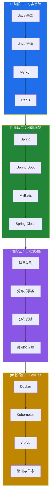

# 📚 My Learning Notes

<p align="center">
  
</p>

<p align="center">
  <a href="#"></a>
  <a href="#"></a>
  <a href="LICENSE"></a>
  <a href="#"></a>
</p>

---

## 📌 项目简介

> 🎯 这里是我的个人学习笔记仓库，记录后端开发、分布式系统、微服务等技术栈的学习记录。


---

## 🗂️ 目录结构

```
MyRepo/
├── 📁 linux/                  # Linux 系统学习
│   ├── 命令行基础/
│   ├── Shell脚本/
│   └── 系统运维/
│
├── 📁 java/                   # Java 后端
│   ├── 核心基础/
│   ├── 并发编程/
│   ├── JVM/
│   └── 新特性/
│
├── 📁 spring/                 # Spring 全家桶
│   ├── Spring/
│   ├── Spring Boot/
│   └── Spring Cloud/
│
├── 📁 database/              # 数据库
│   ├── MySQL/
│   ├── Redis/
│   └── MongoDB/
│
├── 📁 distributed/           # 分布式技术
│   ├── RPC/
│   ├── 消息队列/
│   ├── 分布式事务/
│   └── 分布式锁/
│
├── 📁 microservices/          # 微服务
│   ├── Docker/
│   ├── Kubernetes/
│   └── 服务网格/
│
└── 📁 interview/              # 面试题整理
```

---

## 📖 学习路线图



---

## 🛠️ 技术栈

### 🟢 编程语言

<div align="center">

| 语言 | 掌握程度 | 学习阶段 |
|:---:|:---:|:---:|
|  | ⭐⭐⭐⭐⭐ | 熟练 |
|  | ⭐⭐⭐⭐ | 进阶 |
|  | ⭐⭐⭐ | 学习中 |
|  | ⭐⭐ | 入门 |

</div>

### 🔵 后端框架

<div align="center">

| 框架 | 状态 | 熟练度 |
|:---|:---:|:---:|
| Spring | 🟢 熟练 | ⭐⭐⭐⭐⭐ |
| Spring Boot | 🟢 熟练 | ⭐⭐⭐⭐⭐ |
| Spring Cloud | 🟡 学习中 | ⭐⭐⭐ |
| MyBatis | 🟢 熟练 | ⭐⭐⭐⭐ |
| Dubbo | 🟡 学习中 | ⭐⭐⭐ |

</div>

### 🟣 数据库

<div align="center">

| 数据库 | 状态 | 用途 |
|:---|:---:|:---|
|  | 🟢 熟练 | 主数据库 |
|  | 🟢 熟练 | 缓存 |
|  | 🟡 学习中 | 文档数据库 |

</div>

### 🟠 基础设施

<div align="center">

| 技术 | 状态 | 用途 |
|:---|:---:|:---|
|  | 🟢 熟练 | 容器化 |
|  | 🟡 学习中 | 容器编排 |
|  | 🟢 熟练 | 反向代理 |

</div>

---

## 📊 学习统计

```text
┌─────────────────────────────────────────────────────────────┐
│                                                             │
│   💻 代码学习                                                │
│   ████████████████████████████░░░░░░░░░░░░░░░  65%          │
│                                                             │
│   📖 理论学习                                                │
│   ████████████████████████████████████████░░  85%          │
│                                                             │
│   🔧 实战项目                                                │
│   ██████████████████░░░░░░░░░░░░░░░░░░░░░░  35%          │
│                                                             │
│   📝 面试准备                                                │
│   ████████████████████████████████░░░░░░░░  70%          │
│                                                             │
└─────────────────────────────────────────────────────────────┘
```

---

## 🔥 最近更新

| 日期 | 内容 | 分类 |
|:---|:---|:---:|
| 2026-03-13 | 更新 Linux 笔记 | Linux |
| 2026-03-10 | 新增 Spring Cloud 学习笔记 | Spring |
| 2026-03-08 | 完善 Redis 面试题 | Database |
| 2026-03-05 | 添加分布式事务笔记 | Distributed |

---

## 📈 贡献指南

欢迎提交 PR！请遵循以下步骤：

```bash
# 1. Fork 本仓库
# 2. 创建你的特性分支
git checkout -b feature/your-feature

# 3. 提交你的更改
git commit -m 'Add some feature'

# 4. 推送到分支
git push origin feature/your-feature

# 5. 创建 Pull Request
```

---

## 📝 笔记规范

> 📌 每篇笔记都遵循以下格式：

- ✅ **代码完整**：可运行的示例代码
- ✅ **原理深入**：底层原理分析
- ✅ **细节详尽**：不遗漏关键点
- ✅ **对比分析**：优缺点对比

---

## 📞 联系我

<p align="center">
  <a href="#"></a>
  <a href="#"></a>
</p>

---

## 🙏 致谢

<p align="center">
  
</p>

---

<p align="center">
  <strong>Keep Learning, Keep Growing 🌱</strong>
</p>

<p align="center">
  
</p>
